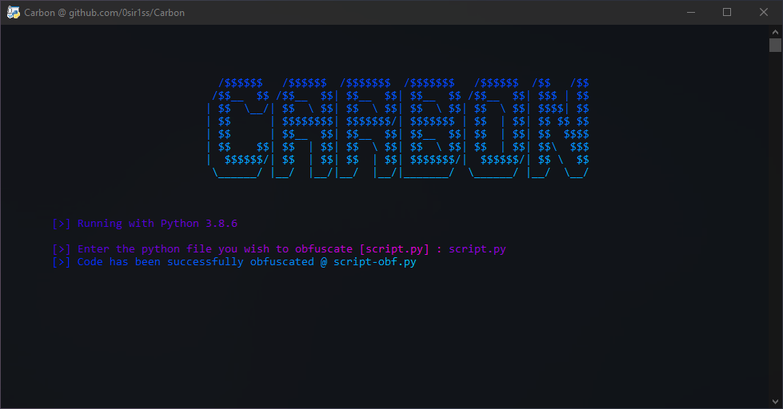

<div align="center" id="top"> 
  

  &#xa0;

</div>

<h1 align="center">[UNMAINTAINED] Carbon</h1>

<p align="center">
  

  

  

  <!--  -->

  <!--  -->
  
  <!--  -->
  
  <!--  -->

</p>


<p align="center">
  <a href="#dart-about">About</a> &#xa0; | &#xa0; 
  <a href="#sparkles-features">Features</a> &#xa0; | &#xa0;
  <a href="#rocket-technologies">Technologies</a> &#xa0; | &#xa0;
  <a href="#white_check_mark-requirements">Requirements</a> &#xa0; | &#xa0;
  <a href="#checkered_flag-starting">Starting</a> &#xa0; | &#xa0;
  <a href="#memo-license">License</a> &#xa0; | &#xa0;
  <a href="https://github.com/0sir1ss" target="_blank">Author</a>
</p>

<br>

## :dart: About ##

When looking around for python obfuscators, you might have found some like pyarmor, or pyminifier.\
But then there's one that does actually obfuscate the code which can't be reversed to the original source. You can find it [here](https://pyob.oxyry.com/), but there's just one small caveat.\
Purchasing it costs **USD $1998**.

Now that's not to say you can't use it for free, after all if you want to use it online it's free to use. But if you wish to use an offline cli version, well then you need to pay.

This is where Carbon comes in. I decided to make my own version of the oxyry obfuscator which does the same job. It renames classes, functions, parameters and variables. It removes docstrings and comments and doesn't stick on a line number at the end of each line. But best of all, it isn't locked to Python 3.3-3.7.

## :sparkles: Features ##

:heavy_check_mark: Remove docstrings and comments\
:heavy_check_mark: Rename classes, functions, parameters and variables

## :rocket: Technologies ##

The following tools were used in this project:

- [Python](https://www.python.org/)

## :white_check_mark: Requirements ##

Before starting, you need to have [Python](https://www.python.org/) installed.

## :checkered_flag: Starting ##

```bash
# Clone this project
$ git clone https://github.com/0sir1ss/Carbon

# Access
$ cd Carbon

# Run the project
$ python carbon.py
```

## :memo: License ##

This project is under license from MIT. For more details, see the [LICENSE](LICENSE) file.


Made with :heart: by <a href="https://github.com/0sir1ss" target="_blank">0sir1s</a>

&#xa0;

<a href="#top">Back to top</a>
